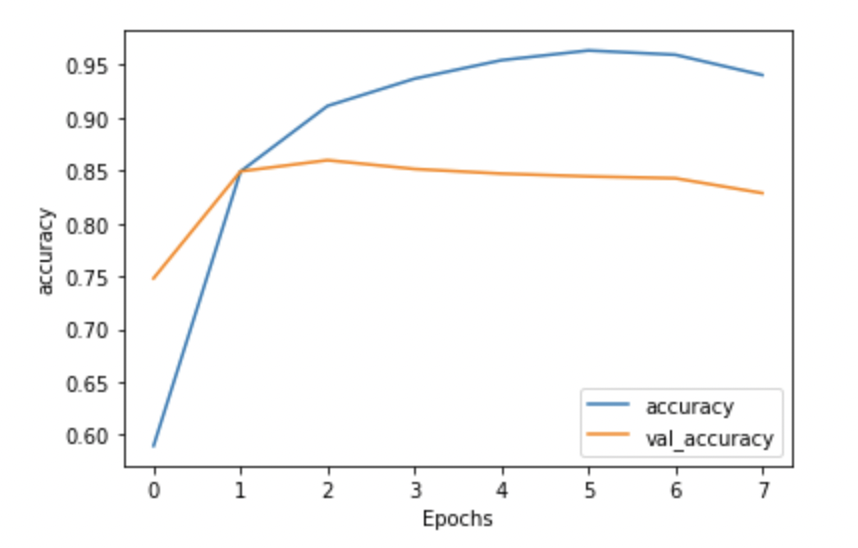

### Fact or Fiction? Are we living in the twilight zone? Have the editors at the onion gotton jobs at reputable organizations like the new york times? 

## Introduction
When I was younger, I used to love reading the onion or the babylon to get a chuckle. However, it seems these days reading real news feels like they were written by editors from the onion. Have these world's converged under my nose?

Wanted to see if I could build a model that could do decent job at determing sarcastic news headlines vs. real ones? The idea is if the model performed really well, I would conclude that the onion editors havn't gotten new jobs at reputable organization. 

I was also curious to see if the model would perform worse on more recent news headlines vs. headlines from the past. The idea here is, if a reputable new organization hired the onion editors, then my model would get fooled...we'll see. 

#### Dataset:

**Training Data**
I started off by using this [dataset](https://www.kaggle.com/rmisra/news-headlines-dataset-for-sarcasm-detection) found on kaggle. The dataset collected headlines from the onion and huffington post. It's over 3 years old, which may be a challenge since news these days may resemble more to the twilight zone than 3+ yeras ago. I also don't know the range of dates the data was aquired. This is the dataset I trained on.

**Evaluation Data**
Through the NYT API I was able to acquire 100,000s of headlines from a variety of timelines. 
- March 2020 - Dec 2021
- 2016
- 2000
- 1969 
- 1852
- 1851 (The year the New York Times started)

I was able to evaluate my results on these datasets.

#### Preprocess and Modeling
  
I had a light preprocess since I wanted to preerve as much of the headline as possible. Thus I did the following:
- Lowercasing
- Removing punctuation
- Hard encoding any digits to a token call "digit_token"
  
Normally for many NLP projects, you would remove stopwords but I decided not too as it would have removed a good portion of all headlines. In addition I wanted a model that could take into account the context of the headline and word positioning. 

For my model, I opted for a LSTM model.

#### Evaluation
The LSTM model itself, trained on 20000 and some observation and was able to reach a validation accuracy around ~83%. Which seemed better than I expected, since we're working with headlines with a max of 20 words and an average of 10 words. It's a hard thing to model, but at least it perfomred way better than a simple Random Forest which got an accuracy around 60%.

Then I evaluated my models on a bunch of headlines from the New York times from a variety of years. 

| Year | % predicted as real news |
| --- | --- | 
| 03-20 to 12-21 | 84.24% |
| 2016 | 81.70% |
| 2000 | 64.95% |
| 1969 | 61.69% |
| 1852 | 72.03% |
| 1851 | 73.90% |

#### Conclusion
The two questions I proposed at the beginning were:
1. Did the onion's editors get hired at reputable news organization (New York Times)?
2. Are News headlines becoming more sarcastic over the years?

In conclusion, for the first question it is possible that the new york times have hired the editors from the onion. I suppose it would have been easier to check LinkedIn.

I did find it interesting that the model performed relatively well against newer datasets than the older datasets, which does not confirm my second question. I guess, I shouldn't be so suprsied at the dataset I trained on is most likley data in the past 3-=7 years and the writing style hasn't changed that much. 

However, it's probably best to get more data and retrain this model. 

#### Deployment

TBD

